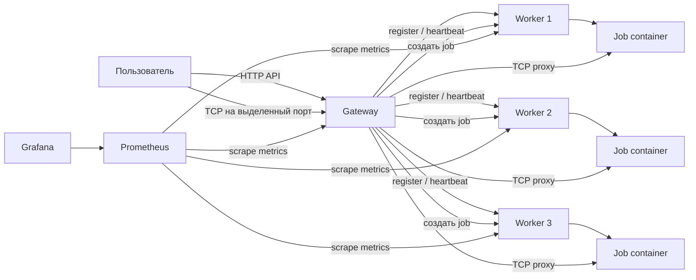

# Распределенные вычисления

Проект сделан по заданию про распределенные вычисления. Нужно было реализовать систему, где пользователь работает только с одним gateway, а реальные вычисления запускаются на отдельных worker-серверах во внутренней сети.

Инструкция по сборке, запуску и ручной проверке вынесена в отдельный файл: [BUILD.md](./BUILD.md).

## Что требовалось сделать

По заданию система должна состоять из одного публичного gateway и нескольких worker-нод. Gateway принимает запросы от пользователя, хранит состояние системы, выбирает свободный worker, открывает порт и проксирует трафик до конкретного контейнера с вычислителем.

Основные требования:

- сделать один gateway, который доступен пользователю снаружи;
- сделать несколько workers во внутренней сети;
- реализовать service discovery, чтобы gateway знал, какие workers сейчас живы;
- по запросу пользователя создавать задачу;
- на выбранном worker поднимать изолированный контейнер с вычислителем;
- на gateway открывать отдельный порт для этой задачи;
- проксировать TCP или UDP трафик от gateway до контейнера задачи;
- сделать API для создания, просмотра и удаления задач;
- добавить мониторинг;
- добавить нагрузочное тестирование.

В проекте реализован вариант с TCP.

## Что реализовано в проекте

В проекте реализована система на Docker Compose. В ней есть:

- gateway на FastAPI;
- три worker-сервиса;
- отдельный Docker-образ job-runner для вычислителя;
- React frontend;
- Prometheus;
- Grafana;
- скрипты для нагрузочного и ручного тестирования.

Пользователь создает задачу через HTTP API gateway. Gateway выбирает worker, создает запись о задаче, выделяет порт из диапазона `5000-5099`, просит worker поднять контейнер job-runner и запускает TCP proxy до этого контейнера.

После этого пользователь подключается к IP gateway и выделенному порту. Внутри TCP-сессии можно отправлять команды `ping`, `stats`, `load`, `stop`, `help`.

## Общая архитектура



Если описывать проще, то gateway является единственной публичной точкой входа. Workers находятся во внутренней docker-сети. Контейнеры с задачами тоже создаются во внутренней сети. Пользователь не обращается к worker напрямую. Он всегда подключается только к gateway.

## Как создается задача

Создание задачи происходит так:

1. Пользователь отправляет запрос `POST /api/jobs` на gateway.
2. Gateway смотрит список зарегистрированных workers.
3. Gateway выбирает worker, у которого есть свободная capacity.
4. Gateway выделяет свободный порт из диапазона `5000-5099`.
5. Gateway отправляет выбранному worker внутренний запрос на создание задачи.
6. Worker через Docker API запускает новый контейнер с образом `distributed-job-runner:latest`.
7. Worker возвращает gateway информацию о контейнере.
8. Gateway запускает TCP proxy с выделенного порта на внутренний адрес контейнера.
9. Пользователь получает `job_id`, `port`, `protocol` и строку для подключения.

После этого пользователь может открыть TCP-соединение на порт gateway и управлять задачей командами.

Пример логической схемы для одной задачи:

```text
gateway:5000 -> TCP proxy -> dc-worker-1-<job_id>:7001
```

Снаружи пользователь видит только `gateway:5000`. Реальный контейнер задачи находится во внутренней сети.

## Как gateway выбирает worker

У каждого worker есть параметр `WORKER_CAPACITY`. В docker-compose для каждого worker задано значение `10`. Это значит, что один worker может держать до 10 активных задач.

Worker периодически отправляет heartbeat на gateway. В heartbeat он передает:

- свой `worker_id`;
- сколько активных jobs сейчас запущено;
- свою capacity;
- статус `online`.

Gateway хранит эту информацию в registry. Когда приходит запрос на создание новой задачи, gateway выбирает только тех workers, которые:

- находятся в статусе `online`;
- не протухли по heartbeat;
- имеют `active_jobs < capacity`.

Если таких workers несколько, gateway выбирает worker с наименьшей относительной загрузкой. То есть он смотрит не только на количество задач, но и на отношение `active_jobs / capacity`.

Например:

```text
worker-1: active_jobs=3, capacity=10, load=0.3
worker-2: active_jobs=1, capacity=10, load=0.1
worker-3: active_jobs=2, capacity=10, load=0.2
```

В этом случае новая задача будет создана на `worker-2`, потому что он менее загружен.

Если свободных workers нет, gateway возвращает ошибку создания задачи.

## Service Discovery

Service Discovery реализован через регистрацию workers на gateway.

При старте worker отправляет запрос:

```text
POST /internal/workers/register
```

После этого worker регулярно отправляет heartbeat:

```text
POST /internal/workers/heartbeat
```

Heartbeat отправляется каждые 5 секунд. Если gateway долго не получает heartbeat от worker, он считает worker недоступным. В настройках gateway задано `WORKER_STALE_SECONDS=15`, поэтому worker считается stale примерно через 15 секунд без heartbeat.

Таким образом gateway не использует заранее жестко записанный список живых workers. Workers сами сообщают gateway, что они доступны и сколько задач могут принять.

## API gateway

Публичные методы для пользователя:

```text
POST   /api/jobs
GET    /api/jobs
GET    /api/jobs/{job_id}
DELETE /api/jobs/{job_id}
GET    /api/workers
GET    /api/system/status
GET    /health
GET    /metrics
```

Главные методы по заданию:

```text
POST /api/jobs
```

Создает новую задачу и возвращает порт для подключения.

```text
GET /api/jobs/{job_id}
```

Возвращает состояние конкретной задачи.

```text
DELETE /api/jobs/{job_id}
```

Останавливает задачу, удаляет контейнер на worker и закрывает proxy на gateway.

## Внутренний API worker

Gateway общается с worker через внутренние endpoints:

```text
GET    /internal/status
POST   /internal/jobs
GET    /internal/jobs/{job_id}
DELETE /internal/jobs/{job_id}
GET    /health
GET    /metrics
```

Эти методы не предназначены для пользователя. Они нужны для связи gateway и workers внутри docker-сети.

## Что находится в папках проекта

```text
.
├── docker-compose.yml
├── Makefile
├── BUILD.md
├── gateway/
├── worker/
├── job-runner/
├── frontend/
├── monitoring/
└── load-tests/
```

### `gateway/`

Здесь находится код центрального gateway.

Основные файлы:

```text
gateway/app/main.py
gateway/app/registry.py
gateway/app/proxy.py
gateway/app/models.py
gateway/app/metrics.py
```

Назначение:

- принимает пользовательские HTTP-запросы;
- хранит состояние workers и jobs;
- выбирает worker для новой задачи;
- выделяет порты из диапазона `5000-5099`;
- запускает TCP proxy до контейнера задачи;
- отдает метрики для Prometheus.

Состояние gateway сохраняется в файл `/data/registry.json`, который лежит в docker volume `gateway-state`. Это нужно, чтобы после перезапуска gateway мог восстановить известные jobs, workers и занятые порты.

### `worker/`

Здесь находится код worker-сервиса.

Основные файлы:

```text
worker/app/main.py
worker/app/docker_runtime.py
worker/app/models.py
worker/app/metrics.py
```

Назначение:

- регистрируется на gateway;
- отправляет heartbeat;
- принимает внутренние запросы на создание и удаление jobs;
- через Docker socket запускает контейнеры job-runner;
- следит за состоянием своих контейнеров;
- отдает метрики для Prometheus.

Worker получает доступ к Docker через проброс:

```text
/var/run/docker.sock:/var/run/docker.sock
```

Это сделано, чтобы worker мог создавать отдельные контейнеры задач на той же Docker-машине.

### `job-runner/`

Здесь находится код вычислителя, который запускается в отдельном контейнере для каждой задачи.

Основной файл:

```text
job-runner/app/server.py
```

Job-runner поднимает TCP-сервер на внутреннем порту `7001`. Он поддерживает команды:

```text
ping
stats
load [seconds]
stop
help
```

Команда `load` создает CPU-нагрузку. Для этого внутри контейнера в цикле считается SHA-256.

### `frontend/`

Здесь находится пользовательский интерфейс на React.

Основные файлы:

```text
frontend/src/App.tsx
frontend/src/api.ts
frontend/src/main.tsx
frontend/src/styles.css
```

Frontend показывает состояние системы через gateway API и WebSocket-обновления. Через него можно смотреть workers, jobs и общую информацию по системе.

### `monitoring/`

Здесь лежит конфигурация мониторинга.

Основные файлы:

```text
monitoring/prometheus.yml
monitoring/grafana/provisioning/
monitoring/grafana/dashboards/distributed-computing-overview.json
```

Prometheus собирает метрики с gateway и workers. Grafana использует Prometheus как datasource и показывает готовый dashboard.

### `load-tests/`

Здесь находятся скрипты для проверки системы.

```text
load-tests/create_jobs.py
load-tests/tcp_test.py
```

`create_jobs.py` создает много jobs через gateway. По нему можно проверить, что задачи распределяются по workers и что capacity учитывается.

`tcp_test.py` создает одну job, подключается к ней по TCP через gateway и отправляет команды в job-runner.

## Где что создается

При запуске docker-compose создаются основные сервисы:

```text
dc-gateway
dc-worker-1
dc-worker-2
dc-worker-3
dc-job-runner-image-holder
dc-frontend
dc-prometheus
dc-grafana
```

Контейнер `dc-job-runner-image-holder` нужен не как рабочая задача, а чтобы собрать и держать локальный образ `distributed-job-runner:latest`.

Когда пользователь создает новую job, worker создает отдельный контейнер. Имя контейнера строится примерно так:

```text
dc-<worker_id>-<job_id>
```

Например:

```text
dc-worker-2-8e1f7a5d-...
```

Именно этот контейнер выполняет команды пользователя. Gateway только проксирует TCP-трафик до него.

## TCP-интерфейс задачи

После создания job пользователь получает порт. К этому порту можно подключиться через TCP.

Job-runner отвечает на команды:

```text
ping
```

Проверка, что контейнер живой. Ответ:

```text
pong
```

```text
stats
```

Показывает информацию о job: id, uptime, количество запросов и версию Python.

```text
load 5
```

Запускает CPU-нагрузку примерно на 5 секунд.

```text
stop
```

Останавливает контейнер job-runner.

## Мониторинг

В проект добавлены Prometheus и Grafana.

Prometheus доступен на порту `9090`. Он собирает метрики с:

```text
gateway:8080
worker-1:9000
worker-2:9000
worker-3:9000
```

Gateway отдает метрики:

```text
gateway_jobs_created_total
gateway_jobs_failed_total
gateway_jobs_deleted_total
gateway_active_jobs
gateway_workers_online
gateway_workers_total
gateway_open_ports
gateway_worker_active_jobs
gateway_worker_capacity
```

Workers отдают метрики:

```text
worker_jobs_started_total
worker_jobs_deleted_total
worker_jobs_failed_total
worker_active_jobs
worker_capacity
worker_cpu_usage_percent
worker_memory_usage_percent
worker_containers_running
```

Grafana доступна на порту `3000`. В проекте уже есть dashboard `Distributed Computing Overview`.

Dashboard показывает:

- количество активных jobs;
- сколько workers сейчас online;
- сколько TCP-портов открыто на gateway;
- распределение jobs по workers;
- CPU usage workers.

По этим графикам удобно смотреть, что задачи действительно распределяются между workers и что при команде `load` появляется нагрузка.

## Как система понимает, что можно создать еще одну job

В проекте есть два уровня проверки.

Первый уровень находится на gateway. Gateway хранит информацию о каждом worker:

```text
worker_id
status
capacity
active_jobs
last_heartbeat
```

Когда пользователь создает job, gateway проверяет, что worker online и что `active_jobs` меньше `capacity`.

Второй уровень находится на самом worker. Даже если gateway по какой-то причине отправит запрос на перегруженный worker, worker перед созданием контейнера еще раз проверяет:

```text
active_jobs_count() >= WORKER_CAPACITY
```

Если лимит уже достигнут, worker вернет ошибку `worker capacity exceeded` и контейнер не будет создан.

Такой двойной контроль нужен, чтобы не создать больше контейнеров, чем разрешено настройкой worker.

## Восстановление и синхронизация состояния

Gateway периодически сверяет состояние jobs с workers. Это нужно, например, если контейнер был остановлен не через HTTP API, а командой `stop` внутри TCP-сессии.

Worker умеет восстанавливать информацию о своих job-контейнерах по Docker labels. При создании контейнера worker добавляет labels:

```text
distributed-computing-platform.job=true
distributed-computing-platform.worker_id=<worker_id>
distributed-computing-platform.job_id=<job_id>
```

После перезапуска worker может найти такие контейнеры и снова добавить их в свое состояние.
