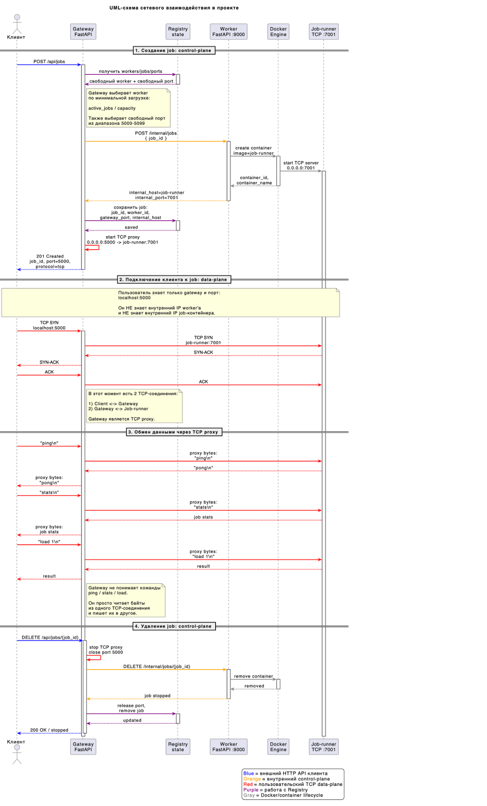
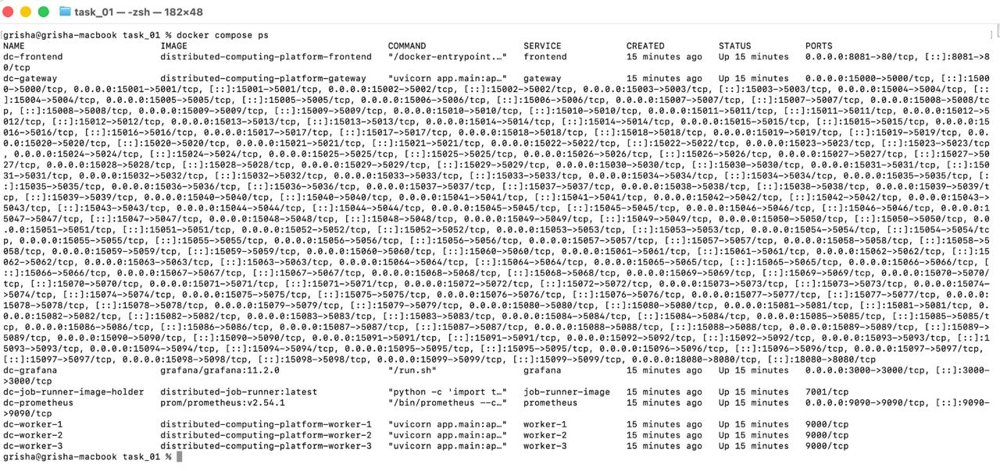
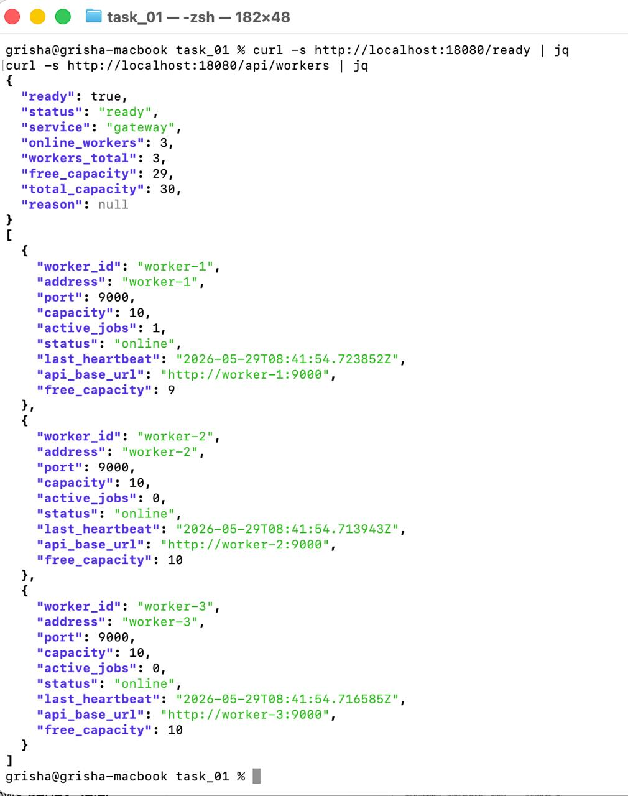
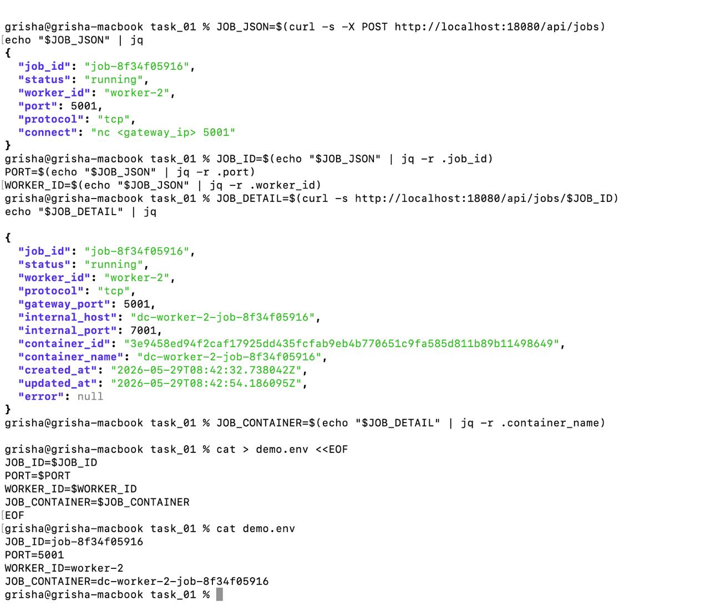
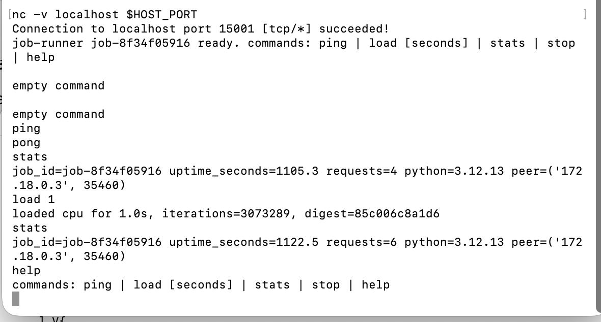
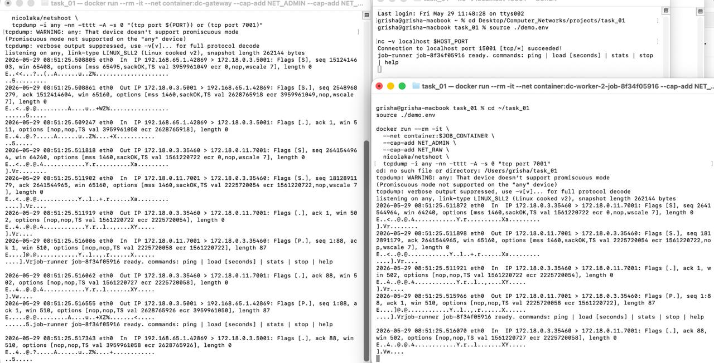
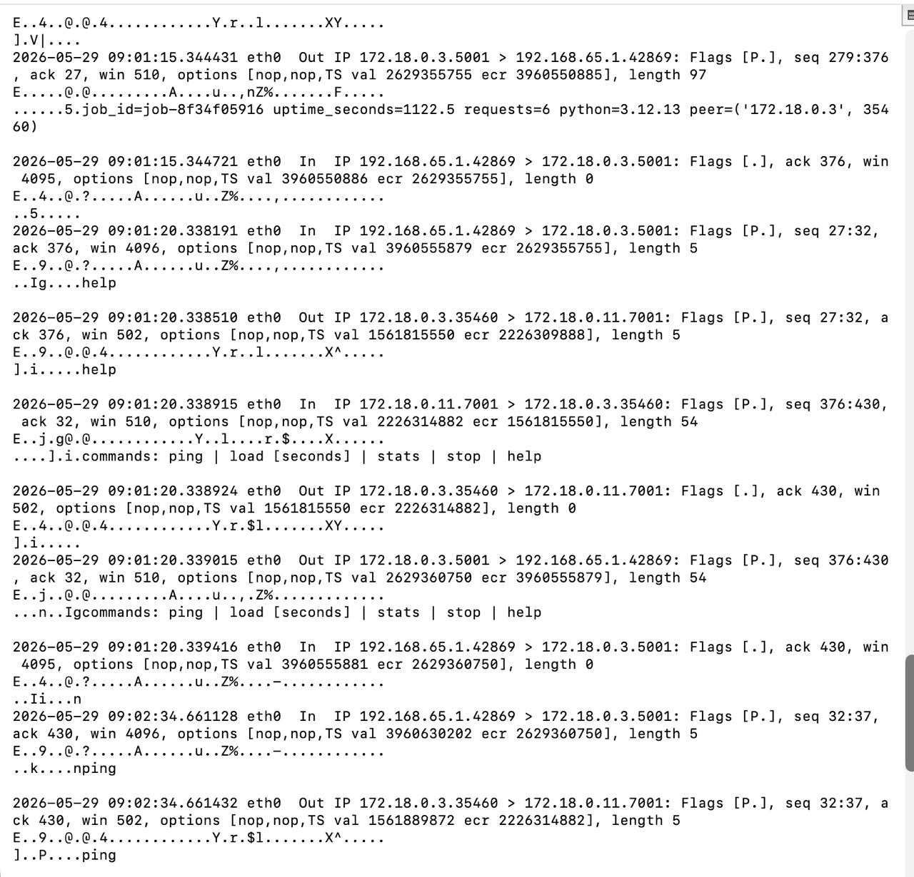
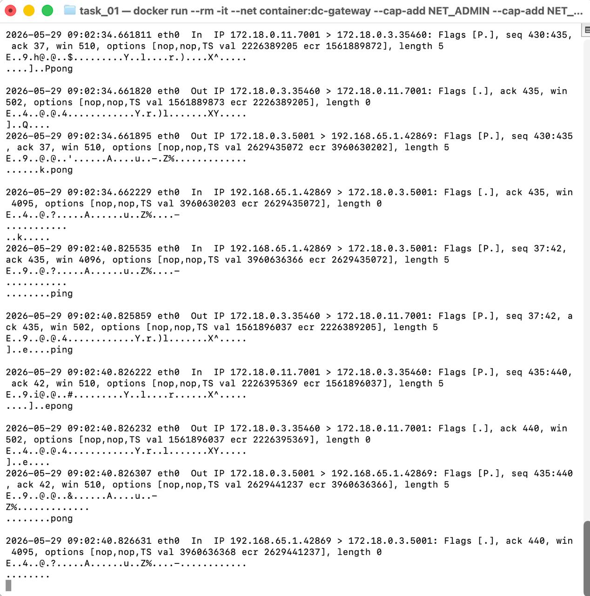
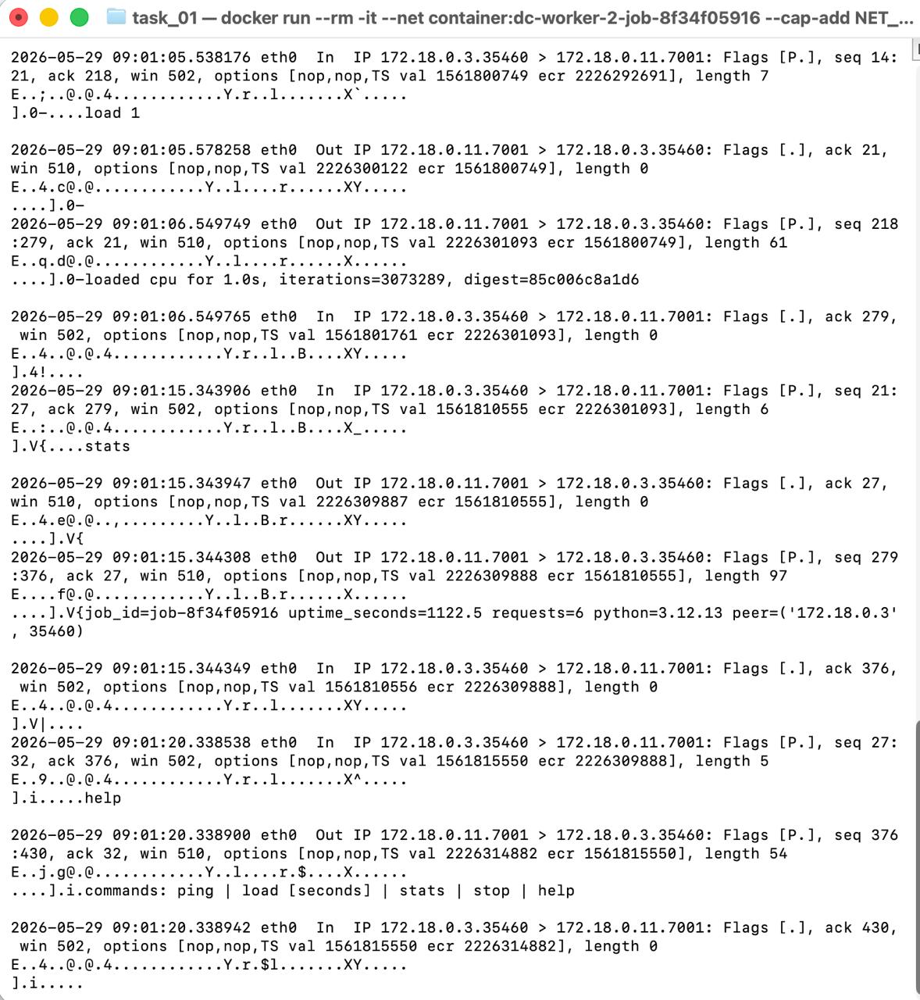
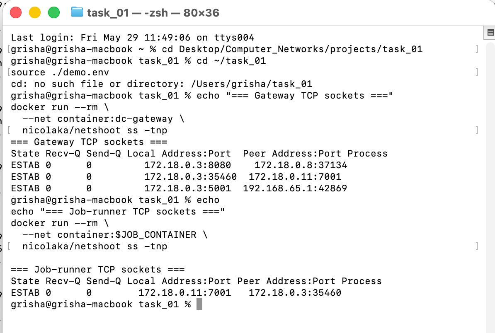

# Дополнения к ABOUT.MD


Этот мдешка показывает, что происходит на сетевом уровне при подключении к job: какие TCP-соединения создаются, между какими узлами идут пакеты и как Gateway прокидывает трафик к контейнеру job-runner.

В схеме проекта для примера используется подключение к `localhost:5000`. В конкретном запуске, который показан ниже, job получила порт `5001` внутри Gateway, а Docker опубликовал его на хосте как `localhost:15001`.

Фактический путь подключения в этом запуске:

```text
Client on host
  -> localhost:15001
  -> Gateway:5001
  -> Job-runner:7001
```

---

## 1. Общая схема



В проекте можно выделить два типа взаимодействия.

**Control-plane** отвечает за управление job: создание, выбор worker, запуск контейнера и хранение информации о job.

```text
Client -> Gateway HTTP API
Gateway -> Worker HTTP API
Worker -> Docker Engine
Docker Engine -> Job-runner container
```

**Data-plane** отвечает за пользовательский TCP-трафик после того, как job уже создана.

```text
Client -> Gateway TCP port
Gateway -> Job-runner TCP port
```

Worker участвует в создании job, но пользовательские команды `ping`, `stats`, `load 1`, `help` идут не в API worker'а, а в контейнер job-runner.

---

## 2. Запущенные контейнеры и опубликованные порты



Gateway публикует наружу диапазон портов:

```text
15000-15099 -> 5000-5099/tcp
```

Это означает, что порт внутри Gateway из диапазона `5000-5099` доступен с хоста через соответствующий порт `15000-15099`.

(Сейчас я сдела так потому что запускал локально на макбуке и что-то маковсоке занимало один из портов 5000-5099 и я решил просто сдвинуть на 10000)

В показанном запуске job получила порт `5001`, поэтому с хоста подключение выполнялось через порт `15001`:

```text
localhost:15001 -> Gateway:5001
```

HTTP API Gateway при этом доступен отдельно:

```text
localhost:18080
```

---

## 3. Проверка Gateway и Workers



Перед созданием job проверяется готовность Gateway:

```bash
curl -s http://localhost:18080/ready | jq
```

Gateway возвращает состояние `ready`.

Также через API видно, что доступны worker-узлы:

```bash
curl -s http://localhost:18080/api/workers | jq
```

В этом запуске были доступны:

```text
worker-1
worker-2
worker-3
```

Каждый worker имеет внутренний HTTP API на порту `9000`. Этот API используется Gateway для создания job.

---

## 4. Создание job



Job создается через Gateway:

```bash
curl -s -X POST http://localhost:18080/api/jobs
```

Gateway возвращает основную информацию:

```json
{
  "job_id": "job-8f34f05916",
  "status": "running",
  "worker_id": "worker-2",
  "port": 5001,
  "protocol": "tcp"
}
```

Детали job показывают, куда Gateway должен прокидывать TCP-трафик:

```json
{
  "gateway_port": 5001,
  "internal_host": "dc-worker-2-job-8f34f05916",
  "internal_port": 7001,
  "container_name": "dc-worker-2-job-8f34f05916"
}
```

Значи для этой job используется такая связка:

```text
Gateway:5001 -> dc-worker-2-job-8f34f05916:7001
```

---

## 5. Роль Gateway, Worker и Job-runner


Worker использую для управления контейнерами. Gateway обращается к worker'у по HTTP, чтобы создать job:

```text
Gateway -> Worker: создать job
Worker -> Docker Engine: запустить контейнер
Worker -> Gateway: вернуть адрес контейнера job-runner
```

После запуска job пользовательский TCP-трафик идет уже не в worker API, а в контейнер job-runner:

```text
Gateway -> Job-runner:7001
```

Поэтому в data-plane фактически участвуют три узла:

```text
Client
Gateway
Job-runner
```

Worker остается частью control-plane.

---

## 6. Подключение клиента



Клиент подключается к опубликованному порту на хосте:

```bash
nc -v localhost 15001
```

После подключения job-runner отправляет приветствие:

```text
job-runner job-8f34f05916 ready. commands: ping | load [seconds] | stats | stop | help
```

Далее через это же TCP-соединение отправляются команды:

```text
ping
stats
load 1
stats
help
```

Ответы приходят обратно в клиентский `nc`:

```text
pong
job_id=job-8f34f05916 uptime_seconds=... requests=...
loaded cpu for 1.0s, iterations=..., digest=...
commands: ping | load [seconds] | stats | stop | help
```

В ответе `stats` видно поле `peer`:

```text
peer=('172.18.0.3', 35460)
```

`172.18.0.3` - это Gateway внутри Docker-сети. Это показывает, что job-runner видит в качестве клиента именно Gateway, а не хост напрямую.

---

## 7. TCP-соединение при подключении к localhost



При подключении пользователя создается не одно сквозное TCP-соединение, а два отдельных TCP-соединения.

Первое соединение:

```text
Client <-> Gateway
192.168.65.1:42869 <-> 172.18.0.3:5001
```

Второе соединение:

```text
Gateway <-> Job-runner
172.18.0.3:35460 <-> 172.18.0.11:7001
```

### 7.1 Client -> Gateway

После команды:

```bash
nc -v localhost 15001
```

сначала устанавливается TCP-соединение между клиентом и Gateway.

В tcpdump это выглядит как обычный three-way handshake:

```text
192.168.65.1.42869 > 172.18.0.3.5001: Flags [S]
172.18.0.3.5001 > 192.168.65.1.42869: Flags [S.]
192.168.65.1.42869 > 172.18.0.3.5001: Flags [.]
```

То есть:

```text
Client -> Gateway: SYN
Gateway -> Client: SYN-ACK
Client -> Gateway: ACK
```

После этого соединение `Client <-> Gateway` считается установленным.

### 7.2 Gateway -> Job-runner

После принятия клиента Gateway открывает второе TCP-соединение к job-runner:

```text
172.18.0.3.35460 > 172.18.0.11.7001: Flags [S]
172.18.0.11.7001 > 172.18.0.3.35460: Flags [S.]
172.18.0.3.35460 > 172.18.0.11.7001: Flags [.]
```

То есть:

```text
Gateway -> Job-runner: SYN
Job-runner -> Gateway: SYN-ACK
Gateway -> Job-runner: ACK
```

После этого соединение `Gateway <-> Job-runner` тоже установлено.

---

## 8. Какие пакеты идут через Gateway



На tcpdump внутри Gateway видно оба направления трафика.

Когда клиент отправляет команду `help`, она сначала приходит на Gateway:

```text
Client -> Gateway: help
```

Затем Gateway отправляет те же байты в job-runner:

```text
Gateway -> Job-runner: help
```

Ответ идет обратно тем же путем:

```text
Job-runner -> Gateway: commands: ping | load [seconds] | stats | stop | help
Gateway -> Client: commands: ping | load [seconds] | stats | stop | help
```

Так же проходят и остальные команды. Например, `stats` сначала идет от клиента к Gateway, потом от Gateway к job-runner. Ответ с `job_id`, `uptime_seconds` и `requests` идет обратно через Gateway.

Gateway в этой схеме не обрабатывает смысл команд. Для него это просто байты TCP-потока.

---

## 9. Пример обмена ping/pong



Для команды `ping` последовательность такая:

```text
Client -> Gateway: ping
Gateway -> Job-runner: ping
Job-runner -> Gateway: pong
Gateway -> Client: pong
```

В tcpdump пакеты с полезной нагрузкой отмечены флагом `[P.]`. Это означает, что в TCP-сегменте есть application data.

Пакеты с флагом `[.]` без текста являются ACK-подтверждениями. Они нужны TCP для подтверждения доставки данных.

---

## 10. Что видно внутри job-runner



На стороне job-runner виден только Gateway:

```text
172.18.0.3:35460 <-> 172.18.0.11:7001
```

Исходный клиентский адрес `192.168.65.1` внутри job-runner не появляется. потому что Gateway создает отдельное соединение к job-runner от своего имени.

На скриншоте видны команды:

```text
load 1
stats
help
```

и ответы job-runner:

```text
loaded cpu for 1.0s, iterations=..., digest=...
job_id=job-8f34f05916 uptime_seconds=...
commands: ping | load [seconds] | stats | stop | help
```

---

## 11. Проверка активных TCP-сокетов



Команда `ss -tnp` внутри Gateway показывает два соединения в состоянии `ESTAB`:

```text
ESTAB 172.18.0.3:5001   192.168.65.1:42869
ESTAB 172.18.0.3:35460  172.18.0.11:7001
```

Первое соединение:

```text
Client <-> Gateway
```

Второе соединение:

```text
Gateway <-> Job-runner
```

Внутри job-runner видно только второе соединение:

```text
ESTAB 172.18.0.11:7001  172.18.0.3:35460
```

Это подтверждает, что Gateway держит два разных TCP-сокета.

---

## 12. Как реализован проброс соединения

Проброс реализован как TCP proxy на уровне приложения.

Алгоритм работы:

```text
1. Gateway слушает выделенный порт, например 5001.
2. Клиент подключается к published port на хосте: localhost:15001.
3. Docker перенаправляет это подключение внутрь Gateway на порт 5001.
4. Gateway принимает клиентское TCP-соединение.
5. Gateway открывает новое TCP-соединение к job-runner на порт 7001.
6. После этого Gateway копирует байты между двумя соединениями.
```

Схематично:

```text
client socket -> Gateway -> job-runner socket
job-runner socket -> Gateway -> client socket
```

На примере `ping` это выглядит так:

```text
Client -> Gateway: ping
Gateway -> Job-runner: ping
Job-runner -> Gateway: pong
Gateway -> Client: pong
```

То есть Gateway не передает исходное TCP-соединение напрямую. Он завершает соединение клиента на себе и создает новое соединение к job-runner. Поэтому у двух соединений разные source ports, разные sequence numbers и свои ACK.

---

## 13 Как worker создает job-контейнер

Создание job начинается на Gateway, но сам контейнер запускает worker.

Общий порядок такой:

```text
Client -> Gateway: POST /api/jobs
Gateway -> Worker: POST /internal/jobs
Worker -> Docker Engine: docker run job-runner image
Docker Engine -> Job-runner: запуск TCP-сервера на 7001
Worker -> Gateway: internal_host, internal_port, container_id, container_name
Gateway: старт TCP proxy на выделенном gateway_port
```

На стороне Gateway при запросе `POST /api/jobs` происходит:

```text
1. Генерируется job_id.
2. Из registry выбирается worker, у которого есть свободная capacity.
3. Резервируется свободный gateway_port из диапазона 5000-5099.
4. Gateway отправляет выбранному worker'у POST /internal/jobs с job_id.
5. После ответа worker'а Gateway сохраняет job в registry.
6. Gateway запускает TCP proxy:
   0.0.0.0:gateway_port -> internal_host:internal_port
```

В коде Gateway это соответствует логике из `gateway/app/main.py`:

```python
worker = await registry.reserve_worker()
gateway_port = await registry.allocate_port()

response = await client.post(
    f"{worker.api_base_url}/internal/jobs",
    json={"job_id": job_id},
)

worker_job = response.json() #сигма гигчад
```

Дальше Gateway создает запись о job и запускает proxy:

```python
await proxy_manager.start_proxy(
    job_id=job_id,
    listen_host="0.0.0.0",
    listen_port=gateway_port,
    target_host=job.internal_host,
    target_port=job.internal_port,
)
```

На стороне worker запрос приходит в endpoint `POST /internal/jobs`. Worker проверяет, что job с таким id еще не запущена, проверяет свою capacity и вызывает Docker runtime:

```python
job = await asyncio.to_thread(runtime.create_job, payload.job_id)
jobs[payload.job_id] = job
return job.public_dict()
```

Сам контейнер создается в `worker/app/docker_runtime.py`. Worker формирует имя контейнера по шаблону:

```text
dc-<worker_id>-<job_id>
```

Для показанного запуска получилось:

```text
dc-worker-2-job-8f34f05916
```

Дальше worker запускает Docker-контейнер из образа `distributed-job-runner:latest` в общей Docker-сети `distributed-compute-net`:

```python
container = self.client.containers.run(
    self.image,
    detach=True,
    name=container_name,
    network=self.network,
    environment={
        "JOB_ID": job_id,
        "JOB_PORT": str(self.job_port),
    },
    labels={
        "distributed-computing-platform.job": "true",
        "distributed-computing-platform.worker_id": self.worker_id,
        "distributed-computing-platform.job_id": job_id,
    },
)
```

В контейнер передаются переменные окружения:

```text
JOB_ID=job-8f34f05916
JOB_PORT=7001
```

После запуска worker возвращает Gateway информацию о контейнере:

```text
internal_host = dc-worker-2-job-8f34f05916
internal_port = 7001
container_name = dc-worker-2-job-8f34f05916
```

Job-runner внутри контейнера запускает обычный TCP-сервер на `0.0.0.0:7001`. Поэтому Gateway потом может подключаться к нему по имени контейнера внутри Docker-сети:

```text
dc-worker-2-job-8f34f05916:7001
```

Цorker не проксирует пользовательский TCP-трафик. Его задача только создать контейнер job-runner и вернуть Gateway адрес, куда дальше надо направлять TCP-соединения.

---

## Итог/Выжимка

При подключении к job создаются два TCP-соединения:

```text
Client <-> Gateway
Gateway <-> Job-runner
```

В конкретном запуске они выглядели так:

```text
Client 192.168.65.1:42869 <-> Gateway 172.18.0.3:5001
Gateway 172.18.0.3:35460 <-> Job-runner 172.18.0.11:7001
```

При установке каждого соединения происходит стандартный TCP handshake:

```text
SYN
SYN-ACK
ACK
```

После этого по TCP идут application data:

```text
ping
pong
stats
load 1
help
```

Причина такой схемы в том, что Gateway работает как application-level TCP proxy. Он принимает клиентское TCP-соединение, открывает отдельное соединение к job-runner и пересылает байты между двумя сокетами.
